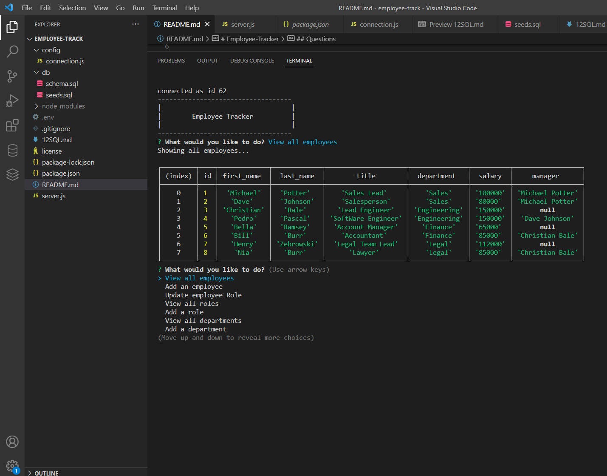

# Employee-Tracker

## Description

The project is an Employee Tracker. Using node and npm, the user creates their own Employee Tracker. The user can then pick a variety of prompts to choose what they would like to do.

## Table of Contents

- [Description](#description)
- [Installation](#installation)
- [Usage](#usage)
- [License](#license)
- [Contributing](#contributing)
- [Tests](#tests)
- [Questions](#questions)

## Installation

To take full advantage of the project node and npm are required to be installed. Jest was also used to test. Mysql2 and console.table were also used.

## Usage

[Link to video](https://drive.google.com/file/d/1w2TcQjs5QC1KXhpo4DHEhTpm1TG-PG_Y/view)
The user will navigate the prompts to see what the user would like to do!

## License

MIT

## Contributing

User starter code from the UofM gitlab site. Also a thanks to MDN docs and W3Schools. Used Node, Jest, Mysql2, and console.table .

## Tests

To test the application open VS code. Open a terminal in VS code and enter node server.js. Answer the provided questions and see the results!

## Questions

Any further questions? Contact information is below!
potter0316@github.com
potter0316@gmail.com
